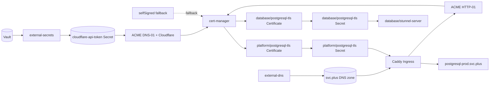

# cert-manager Architecture

This document records the complete certificate control-plane contract for the `svc.plus` platform.

## Scope

The system is split into four distinct responsibilities:

- `cert-manager` owns certificate issuance, renewal, and the target `Secret` objects.
- `Caddy` remains the ingress surface and serves HTTP-01 challenge traffic.
- `external-dns` only manages DNS records for public hostnames.
- `external-secrets` continues to materialize Vault-sourced application secrets, AK/SK pairs, future provider credentials such as the Cloudflare API token, and image pull secrets.

## Default Contract

- `postgresql-prod.svc.plus` defaults to `cert-manager + ACME HTTP-01`.
- `DNS-01 + Cloudflare` is predeclared for wildcard certificates and future subdomains.
- `selfSigned` remains available as an internal temporary or recovery fallback.
- `cert-manager` owns `postgresql-tls` in every namespace that consumes it, so there is no cross-namespace Secret sync job.

## System Diagram

## Operational Rules

- Keep `cert-manager` as the source of truth for TLS Secret ownership.
- Keep `Caddy` as the traffic and HTTP-01 routing layer only.
- Keep `external-dns` focused on DNS record reconciliation.
- Keep `external-secrets` focused on external secret materialization.
- Treat the Cloudflare API token as an external input secret; it can be bootstrapped manually or delivered by `external-secrets` when that path is wired in.
- Prefer namespace-local `Certificate` objects for each consumer namespace.
- Avoid cross-namespace certificate copying or Secret sync controllers.

## Related Playbook Roles

- `vhosts/k3s_platform_bootstrap`
  - installs the platform node and prepares GitOps handoff
- `vhosts/k3s_platform_addon`
  - installs shared platform services such as `cert-manager`, `external-secrets`, `caddy`, and `external-dns`
- `GitOps`
  - owns the namespace-local `Certificate` manifests and workload wiring
